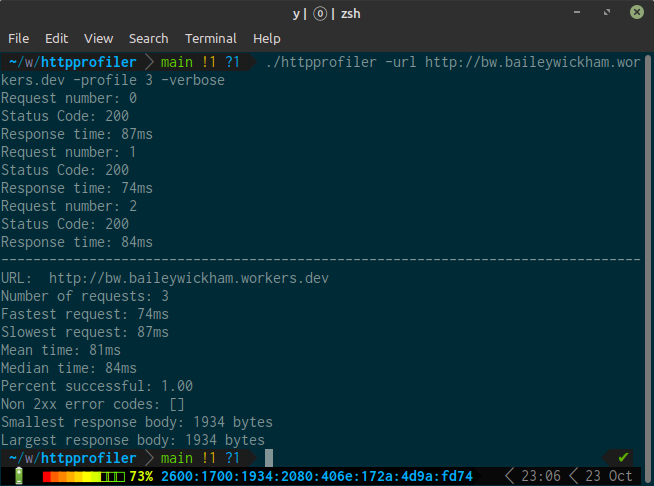

# httpprofiler
Profile websites using custom http requests

Note, this project does not yet support https.
```
Usage of ./httpprofiler:
  -keepalive
        Attempt to use a keepalive connection to use the same TCP connection, fails reguarly
  -profile int
        Number of requests to send (default 2)
  -url string
        URL to profile (default "http://cloudflare.com")
  -verbose
        Print responses as they are recieved
```


## Use
A Dockerfile is provided which runs a default request

Install the stats package:
```bash
go get github.com/montanaflynn/stats
```

Build and run the script
```golang
go bulid .
./httpprofiler -url http://google.com
```

## Project structure
- `http.go` http specific funcitons and structs
- `profile.go` main program logic, tcp connection, printing
- `helper.go` min, max helper functions, maybe eventually median, mean funcs

## FAQ
### Why did you not use goroutines?
While `conn` is safe across goroutines, using multiple threads/goroutines would mess up the timing of responses. This project also would not benifit from parallelization.

### Why use the stats package?
Dealing with time.Duration can be painful because many of the built in methods like sort don't deal with it. Therefore it's easier to convert Durations and use a library.

### What is the keepalive option?
Passing in -keepalive attempts to use a single tcp connection for all http requests. This can be speedy, but can also cause problems when the server closes the connection on you early. Because my http is hacked together, this option reguarly fails. **Use at your own risk**.

### Why are there no tests?
Testing this program would be a little difficult. I could test that I am getting a response, and that it is well formatted, but this is testing the server as much as my program. I also don't really want to test the output, so I would have to rewrite to make the correct functions exposed which is more work than it's worth for this. 

### Why does the size on the response only include the body, not the headers?
When looking at a response, I think the size should only really refer to the size of the body because the headers change with the request, or the method of which you are making the request. I don't think it makes sense to have `curl` and `httpprofiler` return different sizes on the same static webpage. 


